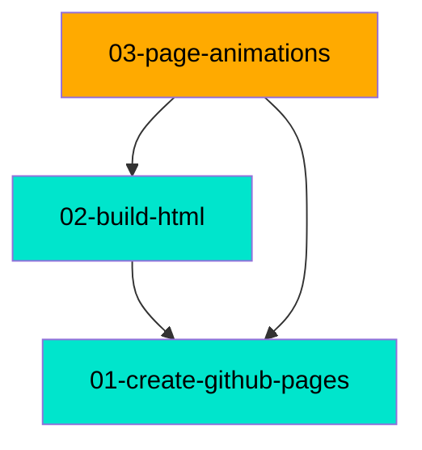

# MDD Connections

## Path Tree

```
Site/
├── Animations  03-page-animations  in_progress
├── Build Pipeline  02-build-html  complete
└── Foundation  01-create-github-pages  complete
```

## Dependency Graph



## Source File Overlap

| Source File | Referenced By |
|-------------|--------------|
| docs/index.html | 01-create-github-pages, 02-build-html, 03-page-animations |
| docs/css/src/animations/scroll-driven.css | 01-create-github-pages, 03-page-animations |
| docs/css/src/components/stat-counter.css | 01-create-github-pages, 03-page-animations |

## Warnings

(none)
